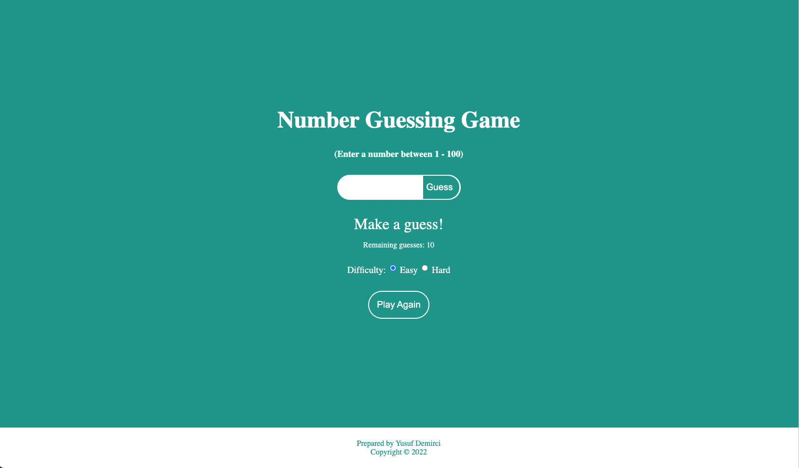

# Number-Guessing-Game

## Overview

### The challenge

Users should be able to:

- View the optimal layout for the component depending on their device's screen size
- See hover states for all interactive elements on the page
- Try to guess the random number between 1-100
- Choose difficulty (easy & hard)
- Track the hints and remaining attemts
- Restart the game when needed

### Screenshot

### Links

- Live Site URL: [https://yusuf-demirci.github.io/Number-Guessing-Game/](https://yusuf-demirci.github.io/Number-Guessing-Game/)

### Built with

- Semantic HTML5 markup
- CSS custom properties
- Flexbox
- Mobile-first workflow
- JavaScript & JQuery
